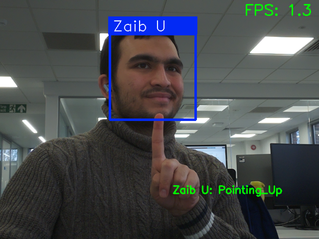

# Real-Time Face and Hand Gesture Recognition on a Raspberry Pi 4 Model B



*The application identifying a user and their hand gesture.*


*The hardware setup: a Raspberry Pi 4 Model B and a Camera Module.*

This project, something I developed for the 3rd year of my MEng Electronic Engineering with Computer Systems course at the University of Southampton, is a real-time recognition system that identifies registered users and their hand gestures from a live video stream. It's designed to run on embedded systems like the Raspberry Pi 4 and serves as a great starting point for anyone interested in exploring the world of Computer Vision and AI on edge devices.

The goal of this repository is to share code, offer insights, and encourage others to build, modify, and experiment with AI-powered applications. Whether you are a student, a hobbyist, or a developer, feel free to dive in, and see what you can create!

## Key Features

-   **Real-Time Face Recognition:** Detects and identifies multiple registered users from a live video stream using the `face_recognition` library.
-   **Multi-Hand Gesture Recognition:** Recognizes 7 different hand gestures ("Victory", "Thumb_Up", "Thumb_Down", "Open_Palm", "Pointing_Up", "ILoveYou", and "Closed_Fist") for up to four hands simultaneously using Google's MediaPipe.
-   **Intelligent Association:** Correctly associates detected hand gestures with the corresponding user by calculating the proximity of the hand to the user's face.
-   **Customizable Responses:** Delivers unique, personalized text-based responses for each recognized gesture and user (e.g., "Peace, Zaib!").
-   **Optimized for Embedded Systems:** Tuned to run on the resource-constrained environment of a Raspberry Pi, with a configurable scaler to balance performance and accuracy.

## Project Structure

```
.
├── dataset/                # Stores images of users for face recognition training.
│   └── USER_NAME/
├── models/                 # Contains the pre-trained gesture recognizer model.
│   └── gesture_recognizer.task
├── src/                    # All the Python source code.
│   ├── image_capture.py    # Script to capture user images for the dataset.
│   ├── model_training.py   # Script to train the face recognition model.
│   └── face_and_gesture_recognition.py # The main application script.
├── .gitignore
├── encodings.pickle        # Generated file containing the face encodings.
├── README.md
└── requirements.txt        # Project dependencies.
```

## Getting Started

Follow these instructions to get the project up and running on your own system.

### Prerequisites

-   Python 3.x
-   A webcam or a Raspberry Pi Camera Module.
-   Hardware (if using Raspberry Pi):
    -   Raspberry Pi 4 Model B (4 GB RAM recommended as a minimum)
    -   Raspberry Pi Camera Module (a compatible stand and/or mount would make using the camera ALOT easier)

### Installation

1.  **Clone the repository:**
    ```bash
    git clone https://github.com/Zaib-U/RPI4B-Face-and-Hand-Gesture-Recognition.git
    cd RPI4B-Face-and-Hand-Gesture-Recognition
    ```

2.  **Create a Virtual Environment (Recommended):**
    ```bash
    python -m venv venv
    source venv/bin/activate  # On Windows use `venv\Scripts\activate`
    ```

3.  **Install Dependencies:**
    ```bash
    pip install -r requirements.txt
    ```

## Usage

The system works in three stages: capturing user images, training the face recognition model, and running the main application.

### 1. Capture User Images

This script captures images of a user's face and saves them in the `dataset` directory.

-   **Important:** Before running, open `src/image_capture.py` and change the `PERSON_NAME` variable to the name of the user you are photographing.

-   Run the script:
    ```bash
    python src/image_capture.py
    ```
-   A window will appear showing the camera feed. Press the **`SPACE`** key to capture an image.
-   Capture about 9-10 images with slight variations in angle and expression for best results.
-   Press **`q`** to quit.

### 2. Train the Face Recognition Model

This script processes all the images in the `dataset` folder and creates an `encodings.pickle` file, which contains the learned face encodings for all registered users.

-   Run the script:
    ```bash
    python src/model_training.py
    ```

### 3. Run the Recognition Application

This is the main script that performs real-time face and gesture recognition.

-   Run the script:
    ```bash
    python src/face_and_gesture_recognition.py
    ```
-   The application will launch, displaying the video feed with bounding boxes around recognized faces and text indicating the detected gestures.
-   Press **`q`** to stop the application.

## Project Report

For a detailed breakdown of the project's design, implementation, and performance analysis, you can read the full project report.

[**View the Full Project Report (PDF)**](./Zaib_Uddin_Individual_Project_Final_Report.pdf)

## Contributing

Contributions are welcome! If you have ideas for improvements, new features, or bug fixes, please feel free to:

1.  Fork the repository.
2.  Create a new branch (`git checkout -b feature/YourAmazingFeature`).
3.  Commit your changes (`git commit -m 'Add some AmazingFeature'`).
4.  Push to the branch (`git push origin feature/YourAmazingFeature`).
5.  Open a Pull Request.

## Acknowledgements

This project was made possible by building upon the excellent work of others in the open-source community and academia.

-   **Core Functionality:**
    -   The facial recognition component was adapted from the guide provided by [Core Electronics](https://core-electronics.com.au/guides/raspberry-pi/face-recognition-with-raspberry-pi-and-opencv/).
    -   The gesture recognition component uses the powerful and efficient [MediaPipe Gesture Recognizer](https://ai.google.dev/edge/mediapipe/solutions/vision/gesture_recognizer) from Google.
    -   The underlying face detection is powered by the [`face_recognition`](https://github.com/ageitgey/face_recognition) library, which is built on top of `dlib`.

-   **Academic Support:**
    -   I would like to extend my sincere gratitude to my project supervisor, **Professor David Thomas**, for his invaluable guidance and support throughout this project.
    -   Thank you to the second examiner, **Dr. Nema Abdelazim**, for their time and feedback.
    -   This project was completed as part of the MEng Electronic Engineering with Computer Systems program at the **University of Southampton**.

## License

This project is open-source and available to everyone. To make it official, consider adding a `LICENSE` file. The [MIT License](https://opensource.org/licenses/MIT) is a great choice for its simplicity and permissive terms.